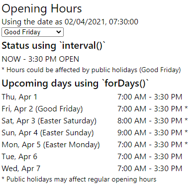

# React Example: Accessing GraphQL Opening Hours

The example React application calls upon the GraphQL service for information
about opening hours for a place using the
[Alpaca Travel GraphQL service](https://github.com/AlpacaTravel/graphql-docs).

This is provided to demonstrate some of the considerations that you can have in
regards to opening hours for places, such as:

- Determining the current status (Open/Closed)
- Upcoming change of status (Closing/Opening soon)
- Reviewing the upcoming week (or future dates) openning hours
- Comments or public holidays affecting the hours
- Time zones and date formatting

Some goals of the GraphQL API included the ability to provide direct access
to ISO-8601 dates, or provide the basis of formatting dates or relative times
without requiring moment.js or date-fns libraries which can increase the total
size of the client.

<p align="center"></p>

## Getting Started

### Installation

```
git clone https://github.com/AlpacaTravel/react-graphql-acessing-place-hours-example
cd react-graphql-acessing-place-hours-example
yarn install
```

### Create your environment variable

Create a `.env.local` in the root of the project with your API Key

```
REACT_APP_GRAPHQL_ACCESS_TOKEN=pk...
```

### Start the Application

```
yarn start
```

### Modifying the GraphQL

This project uses GraphQL Codegen to produce types and hooks from the graphql
files. Use the following to regenerate out your types.

```
yarn graphql-codegen
```
